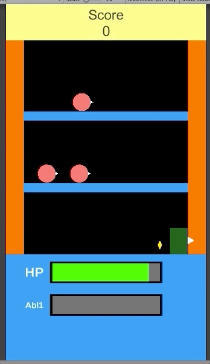

# ChronoSlash
2D Web Game
 

 
This is a 2D Action Platformer made in Unity.
 
It features the following:
* Enemy Spawner with patrolling enemies
* A playable character that can Run, Jump, shoot, and has a chargeable ability to destroy all enemies.
* Scoring System and replayablity
* FX with Unity particle system

can be played here: https://simmer.io/@demastte/livin
